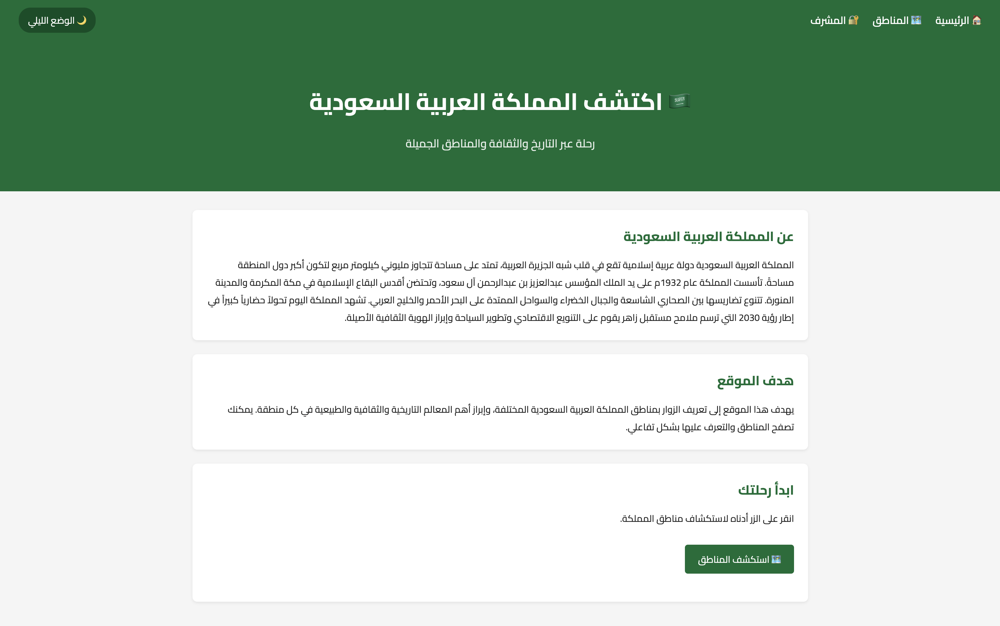
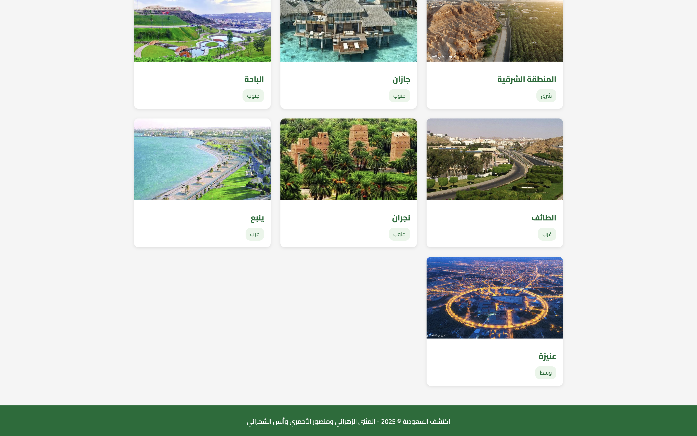
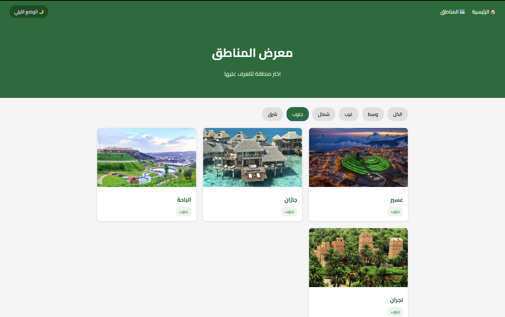
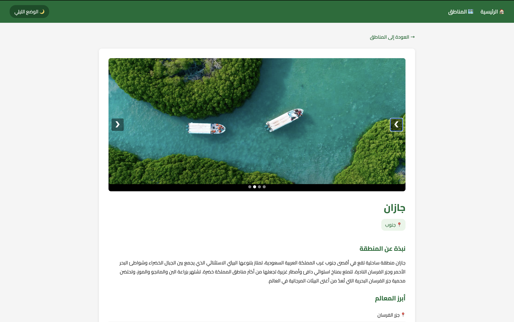
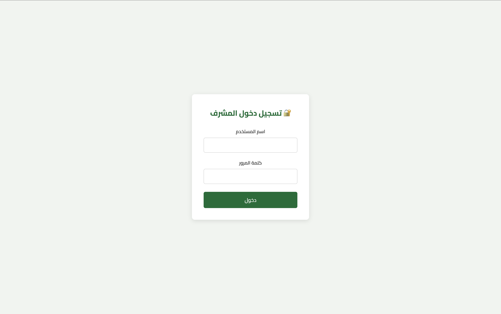
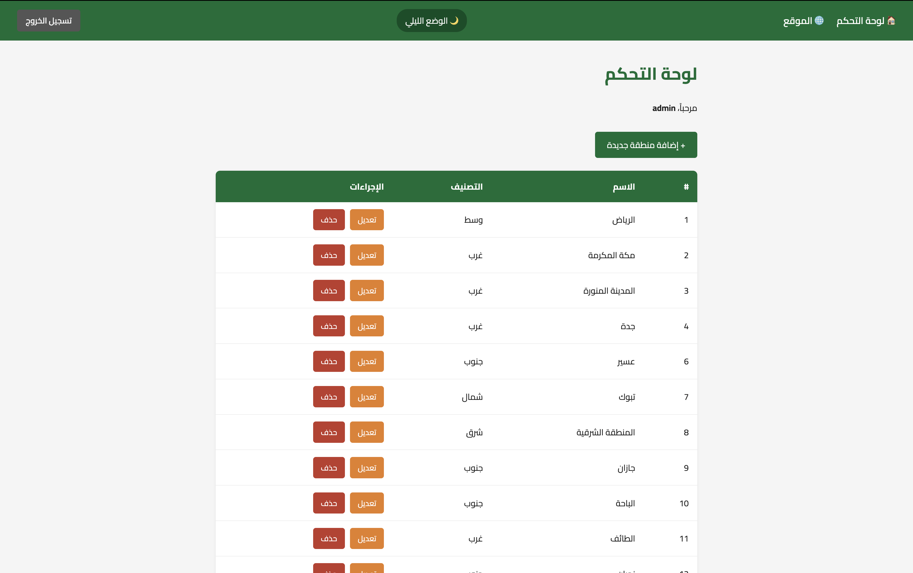
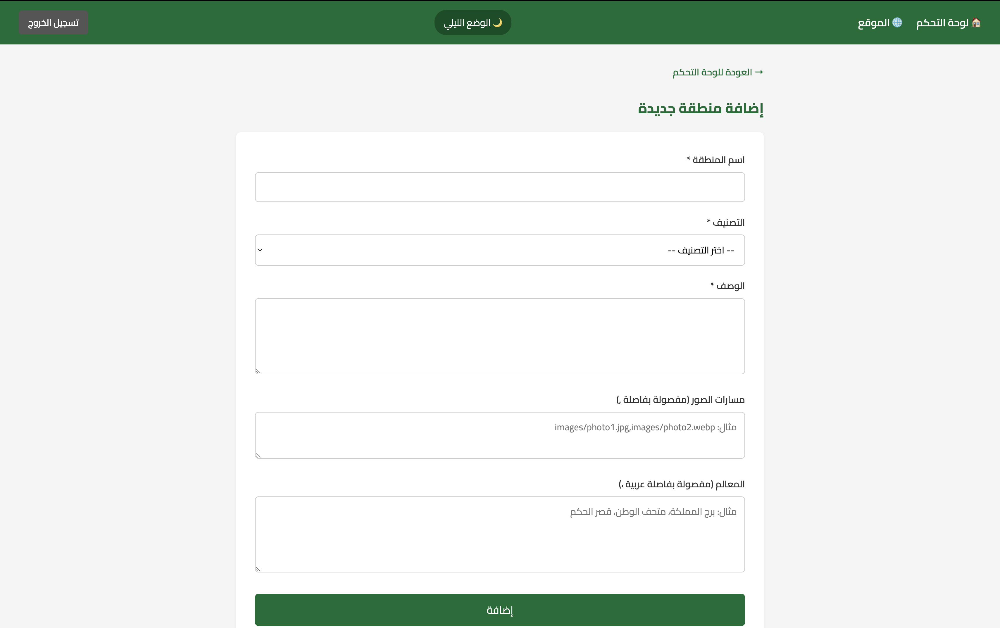
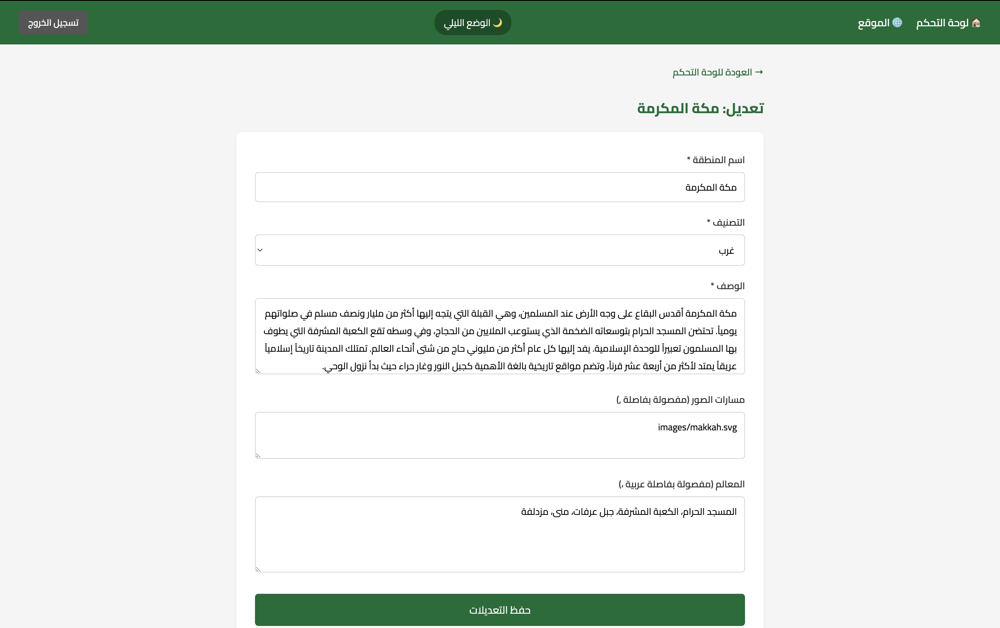

# Discover Saudi Arabia — Project Report

**Course:** CSC457  
**Team Members:** المثنى الزهراني | منصور الأحمري | أنس الشمراني

---

## Overview

*Discover Saudi Arabia* (اكتشف السعودية) is a full-stack Arabic web application that lets users explore the regions of Saudi Arabia. The site presents each region with a description, key landmarks, and a multi-image slideshow. An admin panel allows authorized users to add, edit, and delete regions.

---

## Technology Stack

| Layer | Technology |
|-------|-----------|
| Frontend | HTML5, CSS3, JavaScript |
| Backend | PHP 8 |
| Database | PostgreSQL |
| Font | Cairo (Google Fonts) |
| Server | PHP Built-in Server |

---

## Database Schema

**Table: `regions`**

| Column | Type | Description |
|--------|------|-------------|
| id | SERIAL PRIMARY KEY | Auto-increment ID |
| name | VARCHAR | Region name (Arabic) |
| category | VARCHAR | Region (وسط / غرب / شمال / جنوب / شرق) |
| description | TEXT | Region description |
| image | TEXT | Comma-separated local image paths |
| landmarks | TEXT | Comma-separated landmarks (Arabic comma ،) |

**Table: `admins`**

| Column | Type | Description |
|--------|------|-------------|
| id | SERIAL PRIMARY KEY | Auto-increment ID |
| username | VARCHAR | Admin username |
| password | VARCHAR | MD5-hashed password |

---

## Public Pages

### 1. Home Page (`index.php`)

The landing page introduces the website with a hero section and a brief description of Saudi Arabia. The navigation includes links to the regions gallery and the admin login.

---

### 2. Regions Gallery (`regions.php`)

Displays all regions as a card grid. Users can filter by geographic category (وسط، غرب، شمال، جنوب، شرق) using the filter buttons. Each card shows the region's thumbnail and category badge. Clicking a card navigates to the details page.

**Filtered view (جنوب):**

---

### 3. Region Details (`details.php`)

Shows the full details of a selected region: a multi-image slideshow with arrow buttons and dot indicators, the region category badge, a full description, and a list of key landmarks.

---

## Admin Pages

All admin pages are protected by a session check that redirects unauthenticated users to the login page.

### 4. Admin Login (`admin/login.php`)

Simple login form with username and password fields. Credentials are validated against the `admins` table using an MD5-hashed password comparison.

---

### 5. Dashboard (`admin/dashboard.php`)

Lists all regions in a table with their ID, name, and category. Each row has Edit and Delete action buttons. Deletion is confirmed via a JavaScript dialog. Success messages are shown for add, edit, and delete operations.

---

### 6. Add Region (`admin/add.php`)

Form for creating a new region. Fields include name, category (dropdown), description, image paths (comma-separated), and landmarks (comma-separated with Arabic comma ،). All required fields are validated before submission.

---

### 7. Edit Region (`admin/update.php`)

Pre-filled form for updating an existing region. Pulls current data from the database and allows the admin to modify any field.

---

*اكتشف السعودية © 2025 — المثنى الزهراني ومنصور الأحمري وأنس الشمراني*
